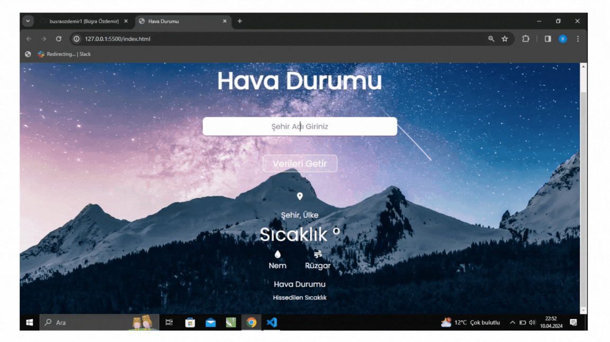

## Weather

- Bu JavaScript projesi, kullanıcının belirli bir konumun (şehir, ülke veya koordinatlar) anlık hava durumu bilgilerini görüntülemesine olanak tanır. OpenWeatherMap API'sini kullanarak gerçek zamanlı hava durumu verilerini çeker ve kullanıcıya sunar.

- Kullanıcı dostu arayüz: Basit ve kullanıcı dostu bir arayüz sağlar. 

- Gerçek zamanlı güncellemeler: OpenWeatherMap API'sini kullanarak hava durumu verilerini anlık olarak çeker.

- Esneklik: Kullanıcılar şehir, ülke adı veya coğrafi koordinatlar gibi farklı giriş biçimlerini kullanabilir. 

- HTML5, CSS3, JavaScript teknolojileri kullanılarak tasarlandı. 

- Kullanılan API: OpenWeatherMap API

### Gif

